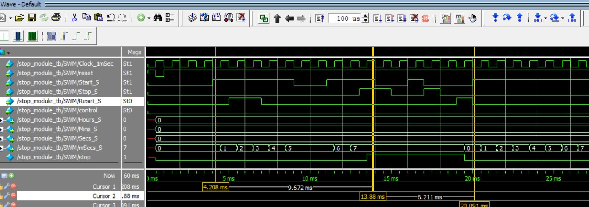

# Results

This document summarizes the **simulation verification results** and **synthesis outcomes** of the Verilog Digital Clock project with Stopwatch and Alarm functionalities.

---

## 1️⃣ Top-Level Simulation Results

Top-level simulation was performed using `Top_module_tb.v` in ModelSim.  
The testbench applied the following signals:

- `Clock_5K`
- `Control`
- `Start_S`, `Stop_S`, `Reset_S`
- `LoadTime`, `LoadAlm`, `AlarmEnable`
- Time and alarm setting inputs

### ✔ Verified Functional Scenarios

| Step | Input Condition | Observed Behavior |
|------|----------------|------------------|
| 1 | `Reset` → `LoadTime = 1` | Current time updated to user-defined value and normal counting resumed |
| 2 | `Control = 0` | System switched to Stopwatch mode |
| 3 | `Start_S = 1` | Stopwatch started counting in 1 ms resolution |
| 4 | `Start_S = 0` | Stopwatch paused |
| 5 | `Stop_S = 1` | Stopwatch entered locked stop state |
| 6 | `Reset_S = 1` | Stopwatch fully reset and stop state cleared |
| 7 | `Control = 1` | System returned to Clock/Alarm mode |
| 8 | 11:59:59 → 12:00:00 | `AM_PM` toggled correctly |
| 9 | Alarm time matched & `AlarmEnable = 1` | Alarm signal asserted for 1 minute |
| 10 | `Control` toggled | `SW_State` asserted for one `Clock_5K` cycle |

---

## 2️⃣ Stopwatch Functional Verification

The stopwatch operates at 1 ms resolution using `Clock_1MSec`.

### ✔ Verified Behavior

- After reset, when `Start_S = 1`, counting begins in milliseconds.
- If `Start_S = 0`, counting pauses.
- If `Stop_S = 1`, the stopwatch enters a locked stop state.
- After `Stop_S = 1`, toggling `Start_S` does not resume operation.
- Only when `Reset_S = 1`, the stopwatch state is cleared and a new counting session can begin.
- Reset_S has priority over Stop_S, ensuring deterministic recovery behavior.
- Time carry structure:
  - 1000 ms → 1 second
  - 60 seconds → 1 minute
  - 60 minutes → 1 hour

This confirms the intended hierarchical counter structure and stop-state protection logic.

### 🔍 Stopwatch Waveform

---

## 3️⃣ Alarm & Clock Functional Verification

The `alarm_clk` module was verified under the following conditions:

### ✔ Time Setting
- When `LoadTime = 1`, the current time is updated to the input setting.
- After loading, time increments every second.

### ✔ Alarm Setting
- When `LoadAlm = 1`, alarm time is updated.
- Alarm is enabled only if `AlarmEnable = 1`.

### ✔ Alarm Trigger Condition
- When current time equals alarm time:
  - `Alarm = 1` for exactly 1 minute (0–59 seconds of that minute).
- Alarm automatically stops after 1 minute.

### ✔ AM/PM Switching
- At 12:00:00, the `AM_PM` parameter toggles.
- Verified during simulation transition from 11:59:59 to 12:00:00.

### ✔ Concurrent Operation
- Clock timekeeping continues independently during alarm setting and alarm triggering.
- Stopwatch operation does not interfere with internal clock or alarm logic.
- Mode switching via `Control` affects only the displayed outputs and does not interrupt internal module execution.
- Independent behavior is achieved through separate always blocks in the RTL design, ensuring deterministic operation of timekeeping, alarm logic, and stopwatch control.

---

## 4️⃣ Top Module Mode Switching & SW_State

- When `Control = 0`, stopwatch outputs are forwarded to top-level display.
- When `Control = 1`, clock/alarm outputs are forwarded.
- On every change of `Control`, `SW_State` becomes high for exactly one `Clock_5K` cycle.
- Verified through waveform observation.

---

## 5️⃣ Synthesis Results

Synthesis was performed using **Vivado** targeting the **ZCU104 Evaluation Board**.

### ✔ Resource Utilization Summary

| Resource | Utilization |
|----------|------------|
| LUT      | 1% |
| FF       | 1% |
| IO       | 18% |
| BUFG     | 1% |

### ✔ Observations

- The design was successfully synthesized without major synthesis errors.
- BUFG resources were inserted during synthesis.
- IO utilization differed from reference material (reason not fully identified).
- Low LUT and FF utilization indicate limited logic resource usage.

### ✔ Gate-Level Output

- Post-synthesis schematic was generated successfully.
- Gate-level structure matches RTL hierarchy.

---

## Summary

The design has been:

- Functionally verified at module and top levels
- Validated for correct timekeeping and AM/PM transition
- Confirmed for proper stopwatch state control logic
- Confirmed for 1-minute alarm duration
- Successfully synthesized with low resource utilization

The verification and synthesis results confirm that the RTL implementation satisfies functional requirements and is synthesizable for FPGA-based implementation.
