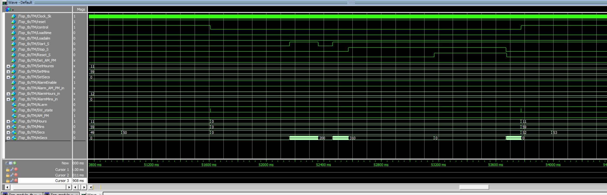
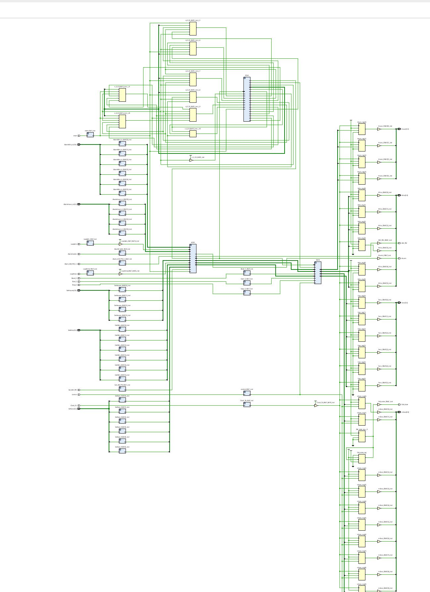

# ⏰ Verilog Digital Clock with Stopwatch & Alarm
### RTL-Based Digital Design & FPGA Synthesis

---

## 📌 Project Overview

This project implements a modular **digital clock system in Verilog HDL**, integrating:

- 12-hour timekeeping with AM/PM format
- Millisecond-resolution stopwatch
- Configurable alarm with exact 1-minute assertion
- Deterministic control logic with stop-state protection

The design was verified using **ModelSim** and synthesized using **Xilinx Vivado** targeting the **ZCU104 Evaluation Board**.

Design Scale:
- 4 RTL modules
- Module-level + top-level verification
- Vivado FPGA synthesis completed

---

## 🧠 Design Objectives

This project focuses on:

- Accurate timekeeping logic (0–59 sec/min, 1–12 hour format)
- Reliable state transitions under control signals
- Concurrent operation ensured via independent always blocks
- Synthesizable RTL structure for FPGA deployment

Key design considerations covered in this implementation:

- Reset priority logic for deterministic recovery
- Stop-state protection preventing unintended restart after `Stop_S`
- Mode switching side-effects handled at the top level (`Control`, `SW_State`)
- Alarm duration enforcement (asserted for one full minute)

---

## 🏗 System Architecture

The system consists of four main RTL modules:

- `Top_module`
- `clock_gen`
- `alarm_clk`
- `stopwatch`

### 🔹 Block Diagram

### 🔹 Architectural Characteristics

- Clear separation of functional units
- Independent always blocks for concurrent logic
- Top-level output multiplexing controlled by `Control`
- Dedicated clock generation for second and millisecond resolution

---

## ⏱ Functional Design Summary

### 1) Clock Generator (`clock_gen`)
- Input: 5 KHz clock  
- Output: 1 Hz (timekeeping), 1 KHz (stopwatch)  
- Deterministic clock division for separated time bases

### 2) Alarm & Timekeeping (`alarm_clk`)
- 12-hour AM/PM timekeeping
- Alarm triggers when current time matches configured alarm time
- Alarm remains asserted for exactly 60 seconds (0–59 seconds in that minute)

### 3) Stopwatch (`stopwatch`)
- Millisecond precision counting
- Start / Pause / Stop / Reset control behavior
- Stop-state protection: once `Stop_S` is asserted, restart requires `Reset_S`
- `Reset_S` priority ensures deterministic recovery

### 4) Top-Level Integration (`Top_module`)
- Mode switching via `Control`
- `SW_State` asserted for one `Clock_5K` cycle when `Control` changes
- Display/output forwarding based on active mode (clock vs. stopwatch)

---

## 🧪 Functional Verification (ModelSim)

Verification was conducted using **ModelSim** with module-level and top-level testbenches.

### ✔ Verification Approach

- Module-level simulation to confirm isolated behavior of each block
- Top-level integration simulation to confirm mode switching and cross-module behavior
- Waveform inspection to confirm expected signal transitions and durations

Verification focused on deterministic state transitions and edge-condition correctness.
Special attention was given to:
- 11:59:59 → 12:00:00 rollover behavior
- Stop-state protection logic
- One-cycle SW_State pulse generation

---

### 🔍 Top-Level Integration Waveform

This waveform demonstrates top-level behavior during mode switching:

- `Control` toggles the display/output source (clock ↔ stopwatch)
- `SW_State` asserts for **one `Clock_5K` cycle** on each `Control` transition
- Stopwatch counting behavior is observed through millisecond-resolution signals

---

### 🔍 AM/PM Transition & Alarm Waveform

This waveform demonstrates timekeeping edge behavior:

- 11:59:59 → 12:00:00 transition
- `AM_PM` toggles correctly at 12:00:00
- Alarm asserts when configured time matches and `AlarmEnable = 1`

---

## 📈 FPGA Synthesis Results (Vivado)

synthesized using **Xilinx Vivado** targeting the **ZCU104 Evaluation Board**. device configuration.

### ✔ Resource Utilization

| Resource | Utilization |
|----------|------------|
| LUT      | 1% |
| FF       | 1% |
| IO       | 18% |
| BUFG     | 1% |

Low LUT and FF utilization indicates limited logic resource usage.

---

### ✔ Post-Synthesis Schematic

The schematic below was generated after synthesis to confirm hierarchy and connectivity.

The low resource utilization confirms that the design complexity is minimal relative to the target FPGA capacity.
No synthesis warnings related to combinational loops or unintended latches were observed.

---

## 🔍 Engineering Highlights

This project demonstrates:
- Structured modular RTL design
- Deterministic control prioritization
- Safe mode-switching without internal logic interruption
- Synthesizable, FPGA-compatible implementation

---

## 📌 Tools & Environment

- **HDL:** Verilog (RTL)
- **Simulation:** ModelSim
- **Synthesis:** Xilinx Vivado
- **Target Board:** ZCU104 Evaluation Board

---

## 📂 Repository Structure
- rtl/  
  Verilog RTL source files  
  - Top_module.v  
  - clock_gen.v  
  - alarm_clk.v  
  - stopwatch.v  
- tb/  
  ModelSim testbenches  
  - Top_module_tb.v  
  - alarm_clk_tb.v  
  - clock_generator_tb.v  
  - stopwatch_tb.v  
- assets/  
  Block diagrams, synthesis images, and waveform captures  
- README.md  
  GitHub overview documentation  
- index.md  
  GitHub Pages main site  

---

© 2026 Dong-Geun Lee  
RTL Digital Design Portfolio
