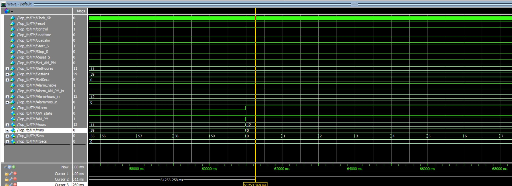

# ⏰ Verilog Digital Clock with Stopwatch & Alarm
### RTL-Based Digital Design & FPGA Synthesis

---

## 📌 1. Project Overview

This project implements a modular **digital clock system in Verilog HDL**, integrating:

- 12-hour timekeeping with AM/PM format
- Millisecond-resolution stopwatch
- Configurable alarm with exact 1-minute assertion
- Deterministic control logic with state protection

The objective is to demonstrate a realistic **RTL-based digital design flow**, including:

- Modular RTL architecture
- Structured simulation verification
- Deterministic control prioritization
- FPGA synthesis and gate-level inspection

The design was verified using **ModelSim** and synthesized using **Xilinx Vivado** targeting the **ZCU104 Evaluation Board**.

---

## 🧠 2. Design Objectives

This project focuses on:

- Accurate timekeeping logic (0–59 sec/min, 1–12 hour format)
- Reliable state transitions under control signals
- Concurrent operation without unintended interference
- Synthesizable RTL structure for FPGA deployment

Unlike simplified classroom examples, this implementation includes explicit handling of:

- Reset priority logic
- Stop-state protection
- Mode switching side-effects
- Alarm duration enforcement

---

## 🏗 3. System Architecture

The system consists of four main RTL modules:

- `Top_module`
- `clock_gen`
- `alarm_clk`
- `stopwatch`

### 🔹 Block Diagram

### 🔹 Architectural Characteristics

- Clear separation of functional units
- Independent always blocks for concurrent logic
- Top-level output multiplexing controlled by `Control`
- Dedicated clock generation for second and millisecond resolution

---

## ⏱ 4. Functional Design Details

### 4.1 Clock Generator (`clock_gen`)
- Input: 5 KHz clock
- Output: 1 Hz (timekeeping), 1 KHz (stopwatch)
- Deterministic clock division logic

---

### 4.2 Alarm & Timekeeping (`alarm_clk`)
- 12-hour AM/PM logic
- Alarm trigger when time matches configured value
- Alarm remains asserted for exactly 60 seconds
- Independent always blocks for time increment and alarm comparison

---

### 4.3 Stopwatch (`stopwatch`)
- Millisecond precision counting
- Start / Pause / Stop / Reset logic
- Stop-state protection
- Reset priority over Stop signal

---

### 4.4 Top-Level Integration
- Mode switching via `Control`
- `SW_State` asserted for one clock cycle on mode transition
- Output forwarding based on active mode
- Internal modules operate independently of display mode

---

## 🧪 5. Functional Verification

Verification was conducted using **ModelSim**.

### ✔ Module-Level Verification
- Clock division correctness
- Stopwatch counter carry structure
- Alarm comparison logic
- Reset priority behavior

### ✔ Top-Level Integration Verification

The waveform below shows:

- Mode switching via `Control`
- Stopwatch operation
- One-cycle `SW_State` pulse

---

### ✔ AM/PM Transition & Alarm Trigger

The following waveform confirms:

- 11:59:59 → 12:00:00 transition
- Correct AM/PM toggle
- 1-minute alarm assertion

---

## 📈 6. FPGA Synthesis Results

Synthesis was performed using **Xilinx Vivado**.

### ✔ Resource Utilization

| Resource | Utilization |
|----------|------------|
| LUT      | 1% |
| FF       | 1% |
| IO       | 18% |
| BUFG     | 1% |

The design occupies minimal FPGA logic resources, indicating modest logic complexity.

---

### ✔ Post-Synthesis Hierarchy

The generated schematic confirms structural alignment with the RTL hierarchy.

---

## 🔍 7. Engineering Highlights

- Modular and synthesizable RTL design
- Deterministic reset and stop-state behavior
- Independent concurrent operation via separate always blocks
- Clean integration between control logic and display outputs
- Low FPGA resource usage

---

## 📌 8. Development Environment

- HDL: Verilog (RTL)
- Simulation: ModelSim
- Synthesis: Xilinx Vivado
- Target Board: ZCU104 Evaluation Board

---

## 📂 Repository Structure
rtl/ → RTL source files
tb/ → ModelSim testbenches
assets/ → Diagrams & waveforms
README.md → GitHub overview
index.md → GitHub Pages site

---

© 2026 Dong-Geun Lee  
RTL Digital Design Portfolio
